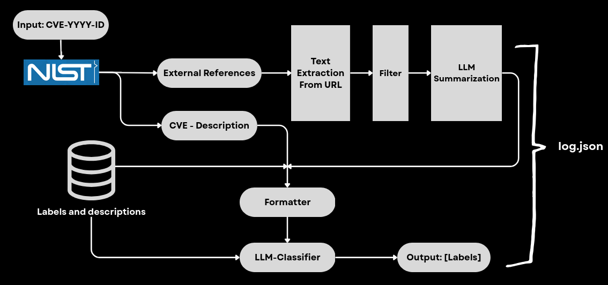

# CVE_expert
The idea behind this project is to develop a simple AI-based tool that allows to get information about CVEs. A problem that is faced by the experts is that the CVE description, and even on NVD are not well detailed and to understand in depth the vulnerability, one has to visit many different resources in order to understand what is facing. This solutions try to solve this problem, in the most simple way, using an LLM model specified by the user.

TODO:
* Build a structured output using the langchain functionality.
* Select meaningful CVEs to test.
* Automatize evaluation using SOTA-LLM labels.
* Handle the absence of External references.
    * Use CVSS metrics (4.0)
    * CWE
